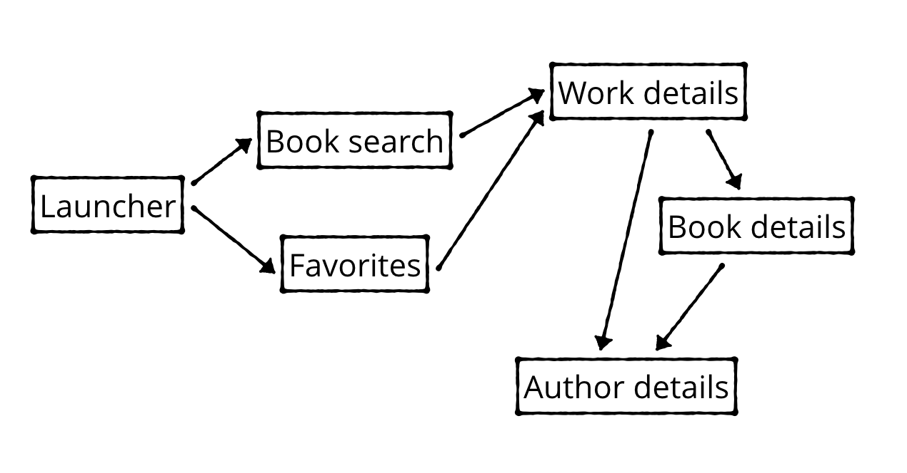
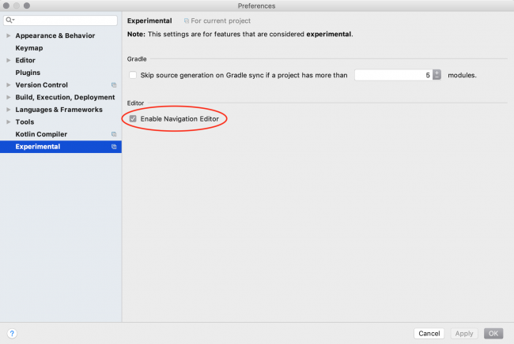
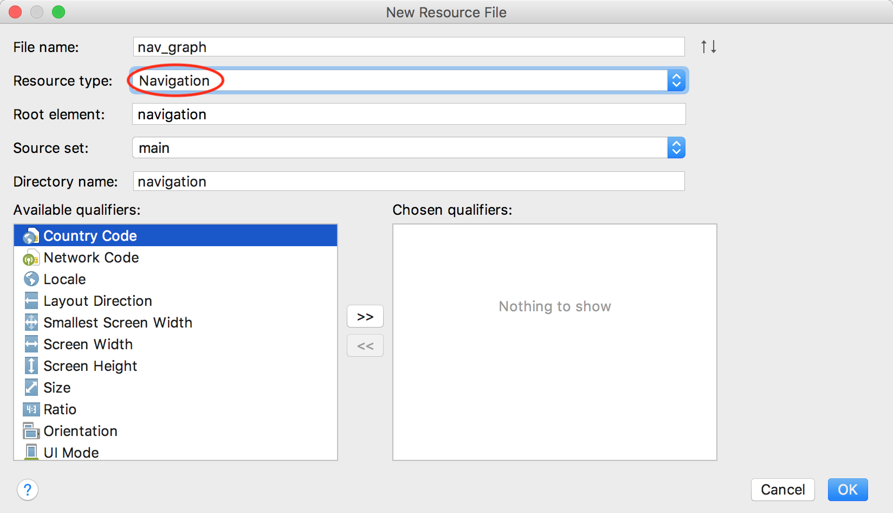
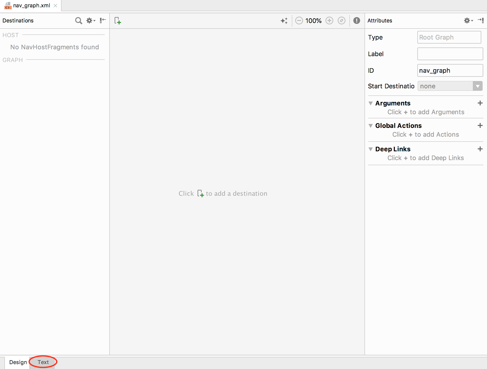

# the navigation architecture component

### Why Do You Need Yet Another Component?

Navigating between screens — passing data, handling the back stack, implementing deep links, etc. — can be complicated. It also comes with quite a bit of boilerplate. To top it off, you should adhere to the new principles of navigation:

- The app should have a fixed start destination.
- A stack is used to represent the navigation state of an app.
- The Up button never exits your app.
- Up and Back are equivalent within your app’s task.
- Deep linking to a destination or navigating to the same destination should yield the same stack.

By using the Navigation architecture component, you provide a consistent and predictable experience to users — hassle and boilerplate free.

### Adding the Navigation Architecture Component

Open the build.gradle file in the app folder and add the following to the `dependencies` block:

```java
implementation "android.arch.navigation:navigation-fragment-ktx:1.0.0-alpha05"
implementation "android.arch.navigation:navigation-ui-ktx:1.0.0-alpha05"
```

Wondering about the -ktx suffix in the library names? It signifies the Android KTX libraries that are super nice to use with Kotlin by making your code both more concise and readable.

## Navigation Graph

A set of destinations and actions compose an app’s navigation graph:



The above represents the navigation graph for the Bookmans Treasure app. Nodes represent the screens and arrows show how you navigate between them.

You’ll add the navigation graph to the app now.

You must first enable the **Navigation Editor. Click File ▸ Settings** (or Android Studio ▸ Preferences on Mac), choose the **Experimental** category in the left panel, check **Enable Navigation Editor**:



Click **OK** and then restart Android Studio.

Now be sure Android is selected in the Project navigator.

Click on the **res** folder, press **command+N (on Mac)** or **Alt+N (on PC)** (or File ▸ New) and select Android Resource File.

A dialog to create a new resource will pop up. Under **File name**, enter **nav_graph**. Under** Resource type**, select **Navigation**.



Click **OK**.

Android Studio will create a new resource directory called navigation with a new file named **nav_graph.xml**. This is where your navigation graph will live.

Opening **nav_graph.xml**, you can toggle between the Text editor and the Navigation editor by clicking the tabs at the bottom of the editor window.



Click on the **Text** tab to open the **XML editor**.

### Destinations

Each destination represents a screen you can navigate to. By default, the Navigation architecture component includes support for Activities and Fragments. You’ll learn how to add custom types later in this tutorial.

Add the following between the navigation tags:

```xml
<fragment
  android:id="@+id/bookSearchFragment"
  android:name="com.kaanf.android.bookmanstreasure.ui.booksearch.BookSearchFragment"
  android:label="Book Search Fragment"
  tools:layout="@layout/fragment_book_search">
</fragment>
```

You might get an error on the `tools:layout` attribute. To fix it, add `tools` namespace declaration to the navigation tag:

```java
xmlns:tools="http://schemas.android.com/tools"
```

You can do this manually or place your cursor on tools:layout and press **Alt+Enter (on PC)** or **command+return(on Mac)**. You’ll get a Quick action pop-up:

Choose **Create namespace declaration.**

This makes `BookSearchFragment` a destination. `Fragment` destinations have the following attributes:

- `android:id`: A unique resource name for this destination.
- `android:name`: A fully qualified class name.
- `android:label`: The Fragment title.
- `tools:layout`: The Fragment layout, rendered by the Navigation editor.

Build and run the app. Getting fed up with the blank screen yet?

### Declaring a Start Destination

Every app needs a starting point. To declare a starting destination in the `navigation graph`, add the following attribute to the navigation tag:

```java
app:startDestination="@+id/bookSearchFragment"
```

If the app namespace yields an error, follow the same set of steps you used above for the tools namespace to fix it. Build and run to make sure there are no errors. Seriously — blank screen, again?
