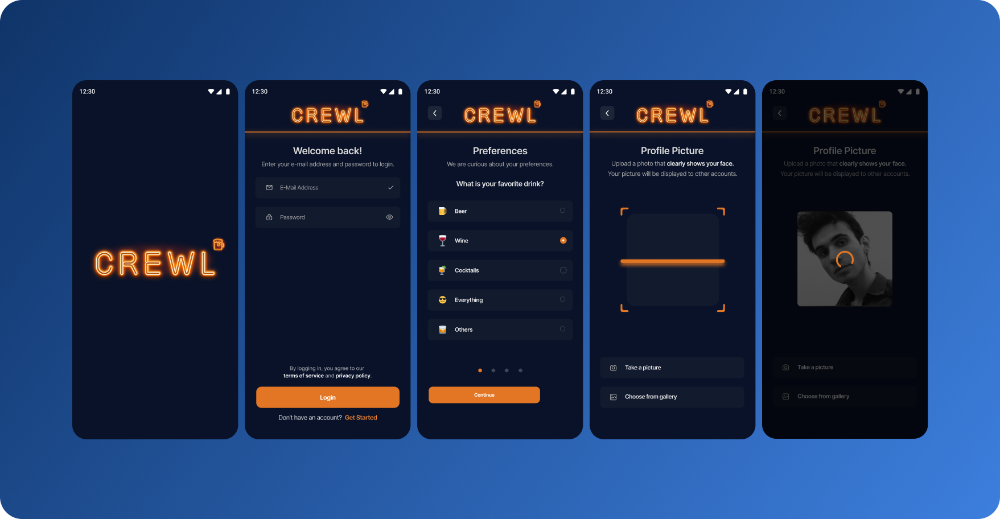
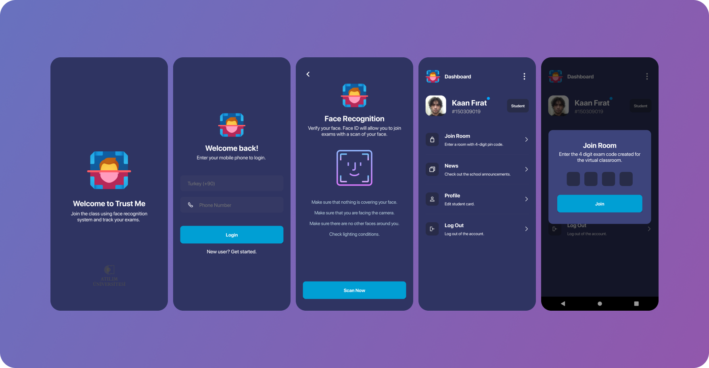
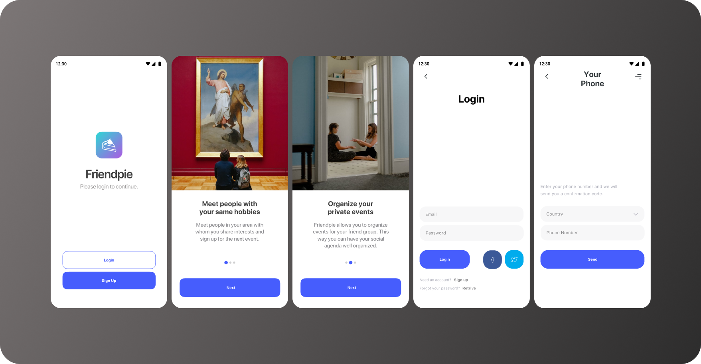

# portfolio

### Crewl
---

> UI & UX design for a social game application.
>
> Personal conceptual side project.

### TrustMe
---

> UI & UX design for a face recognition application.
> **TrustMe** project is properly designed to be used with Android devices as a mobile application, for taking instant attendancy with face recognition in the classrooms.
> 
**[Github](https://github.com/kaanf/trust-me)**

### Friendpie
---

> UI & UX design for a social networking platform.
> 🧑‍🤝‍🧑 **Friendpie** matches people with common interests and hobbies. This project has been stopped and will continue again soon. 
> 
**[Github](https://github.com/kaanf/friendpie-app)**
>
>**[Landing Page](https://kaanf.github.io/minimal-landing-page/)**
