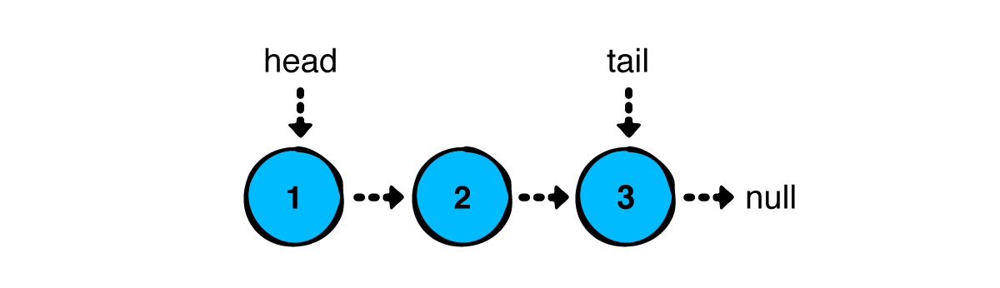
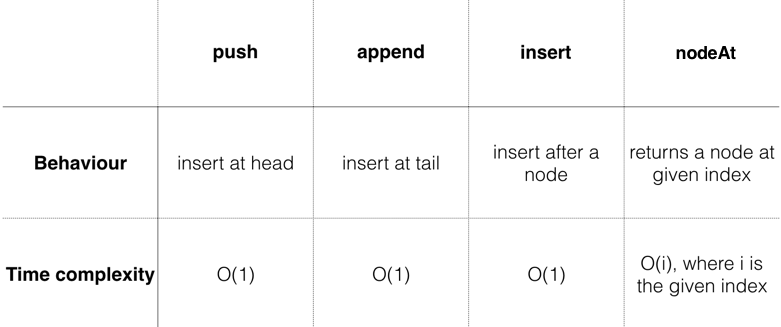
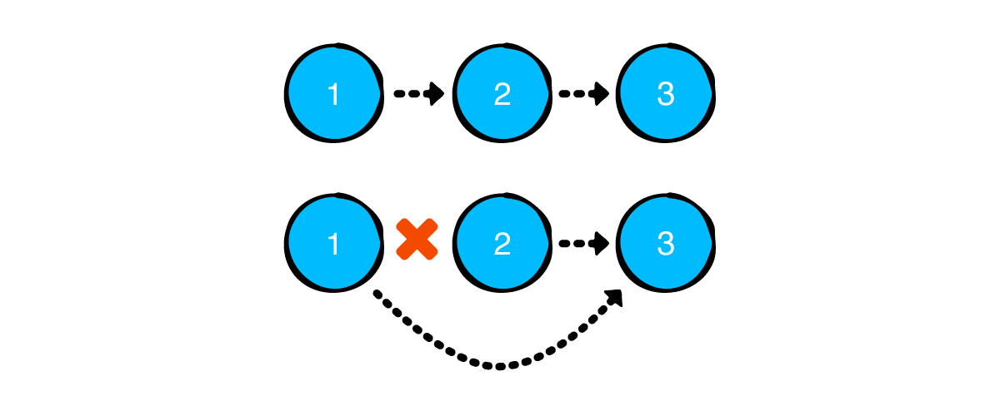

# linked list

A linked list is a collection of values arranged in a linear, unidirectional sequence. A linked list has several theoretical advantages over contiguous storage options such as the `Kotlin Array` or `ArrayList`: 
- Constant time insertion and removal from the front of the list. 
- Reliable performance characteristics.

|  |
|:--:| 
| *A linked list* |

As the diagram suggests, a linked list is a chain of nodes. Nodes have two responsibilities: 

1. Hold a value. 
2. Hold a reference to the next node. **The absence of a reference to the next node, null, marks the end of the list.**

|  |
|:--:| 
| *A node holding the value 12* |

## Node

Create a new **Kotlin file** and name it `Node.kt`. Add the following to the file:

```kotlin
data class Node<T>(var value: T, var next: Node<T>? = null) {
  override fun toString(): String {
    return if (next != null) {
      "$value -> ${next.toString()}"
    } else {
      "$value"
    }
  }
}
```

Navigate to the `Main.kt` file and add the following inside **main():**

```kotlin
fun main() {
    "creating and linking nodes" example {
        val node1 = Node(value = 1)
        val node2 = Node(value = 2)
        val node3 = Node(value = 3)
        node1.next = node2
        node2.next = node3
        println(node1)
    }
}
```

You’ve just created three nodes and connected them:

|  |
|:--:| 
| *A linked list containing values 1, 2, and 3* |

Once you run `Main.kt`, we’ll see the following output in the console:

```kotlin
---Example of creating and linking nodes---
1 -> 2 -> 3
```

:::info
As far as practicality goes, this method of building lists is far from ideal. You can easily see that building long lists in this way is impractical. **A common way to alleviate this problem is to build a LinkedList that manages the Node objects.**
:::

## LinkedList

Create a new file and name it LinkedList.kt. Add the following to the file:

```kotlin
class LinkedList<T> {
    private var head: Node<T>? = null
    private var tail: Node<T>? = null
    private var size = 0
    fun isEmpty(): Boolean {
        return size == 0
    }
    override fun toString(): String {
        if (isEmpty()) {
            return "Empty list"
        } else {
            return head.toString()
        }
    }
}
```

A linked list has the concept of a `head` and `tail`, which refers to the **first and last** nodes of the list respectively:

|  |
|:--:| 
| *The head and tail of the list* |

You’ll also keep track of the size of the linked list in the size property. This might not seem useful yet, but it will come in handy later.

## Adding values to the list

There are three ways to add values to a linked list, each having their own unique performance characteristics: 

1. **push**: Adds a value at the front of the list. 
2. **append**: Adds a value at the end of the list. 
3. **insert**: Adds a value after a particular node of the list. 

Let's implement each of these in turn and analyze their performance characteristics.

### Push operations

Adding a value at the front of the list is known as a push operation. This is also known as **head-first insertion**. The code for it is deliciously simple. 

Add the following method to `LinkedList`:

```kotlin
fun push(value: T) {
    head = Node(value = value, next = head)
    if (tail == null) {
        tail = head
    }
    size++
}
```

In the case in which you’re pushing into an empty list, the new node is both the head and tail of the list. Since the list now has a new node, you increment the value of **size.**

In `Main.kt`, add the following in main():

```kotlin
"push" example {
    val list = LinkedList<Int>()
    list.push(3)
    list.push(2)
    list.push(1)
    println(list)
}
```

Your console output will show this:

```kotlin
---Example of push---
1 -> 2 -> 3
```

This is pretty cool, but you can do even better. We'll use the `fluent interface pattern` to chain multiple push calls. Go back to **push()** and add **LinkedList&lt;T&gt;** as its return type. Then, add a return this line at the end to return the list that you’ve just pushed an element into.

```kotlin
fun push(value: T): LinkedList<T> {
    head = Node(value = value, next = head)
    if (tail == null) {
        tail = head
    }
    size++
    return this
}
```

In `main()`, you can now rewrite the previous example, making use of **push()**’s return value:

```kotlin
"fluent interface push" example {
    val list = LinkedList<Int>()
    list.push(3).push(2).push(1)
    println(list)
}
```

*That’s more like it!* Now that you can add multiple elements to the start of the list with ease.

### Append operations

The next operation we'll look at is **append**. This adds a value at the end of the list, which is known as **tail-end insertion. **

In `LinkedList.kt`, add the following code just below push():

```kotlin
fun append(value: T) {
    // 1
    if (isEmpty()) {
        push(value)
        return
    }
    // 2
    tail?.next = Node(value = value)
    // 3
    tail = tail?.next
    size++
}
```

**This code is relatively straightforward: **

1. Like before, if the list is empty, we’ll need to update both head and tail to the new node. Since append on an empty list is functionally identical to `push`, you invoke `push` to do the work for you. 
2. In all other cases, you create a new node *after* the current tail node. tail will never be null here because you’ve already handled the case where the list is empty in the if statement. 
3. Since this is **tail-end insertion**, your new node is also the tail of the list.

Go back to `Main.kt` and write the following at the bottom of main():

```kotlin
"append" example {
    val list = LinkedList<Int>()
    list.append(1)
    list.append(2)
    list.append(3)
    println(list)
}
```

### Insert operations

The third and final operation for adding values is `insert(afterNode: Node&lt;T&gt;)`. This operation inserts a value at a particular place in the list and requires two steps: 

1. Finding a particular node in the list. 
2. Inserting the new node after that node. 

First, we’ll implement the code to find the node where you want to insert your value.

In `LinkedList.kt`, add the following code just below append:

```kotlin
fun nodeAt(index: Int): Node<T>? {
    // 1
    var currentNode = head
    var currentIndex = 0
    // 2
    while (currentNode != null && currentIndex < index) {
        currentNode = currentNode.next
        currentIndex++
    }
    return currentNode
}
```

**nodeAt()** tries to retrieve a node in the list based on the given index. Since you can only access the nodes of the list from the **head node**, you’ll have to make iterative traversals. Here’s the play-by-play: 

1. You create a new reference to head and keep track of the current number of traversals. 
2. Using a while loop, you move the reference down the list until you reach the desired index. Empty lists or out-of-bounds indexes will result in a null return value. 

*Now, we need to insert the new node.*

```kotlin
fun insert(value: T, afterNode: Node<T>): Node<T> {
    // 1
    if (tail == afterNode) {
        append(value)
        return tail!!
    }
    // 2
    val newNode = Node(value = value, next = afterNode.next)
    // 3
    afterNode.next = newNode
    size++
    return newNode
}
```

Here’s what we've done: 

1. In the case where this method is called with the **tail** node, you call the functionally equivalent append method. This takes care of **updating tail.** 
2. Otherwise, you create a new node and link its next property to the next node of the list. 
3. You reassign the next value of the specified node to link it to the new node that you just created.

To test things, go back to `Main.kt` and add the following to the bottom of main():

```kotlin
"inserting at a particular index" example {
    val list = LinkedList<Int>()
    list.push(3)
    list.push(2)
    list.push(1)
    println("Before inserting: $list")
    var middleNode = list.nodeAt(1)!!
    for (i in 1..3) {
        middleNode = list.insert(-1 * i, middleNode)
    }
    println("After inserting: $list")
}
```

**You’ll see the following output:**

```kotlin
---Example of inserting at a particular index---
Before inserting: 1 -> 2 -> 3
After inserting: 1 -> 2 -> -1 -> -2 -> -3 -> 3
```

## Performance analysis

To recap, we've implemented the three operations that **add values to a linked list** and a method to **find a node at a particular index**.

|  |
|:--:| 

## Removing values from the list

There are three primary operations for *removing nodes*: 

1. **pop**: Removes the value at the front of the list. 
2. **removeLast**: Removes the value at the end of the list. 
3. **removeAfter**: Removes a value anywhere in the list. 

### Pop operations

Removing a value at the front of the list is often referred to as pop. This operation is almost as simple as `push()`, so dive right in. 

Add the following method to `LinkedList`:

```kotlin
fun pop(): T? {
    if (!isEmpty()) size--
    val result = head?.value
    head = head?.next
    if (isEmpty()) {
        tail = null
    }
    return result
}
```

`pop()` returns the value that was removed from the list. **This value is optional since it’s possible that the list is empty.** 

:::note
By moving the head down a node, you’ve effectively removed the first node of the list. The garbage collector will remove the old node from memory once the method finishes since there will be no more references attached to it. If the list becomes empty, you set tail to null as well.
:::

To test, go to `Main.kt` and add the following code at the bottom inside main():

```kotlin
"pop" example {
    val list = LinkedList<Int>()
    list.push(3)
    list.push(2)
    list.push(1)
    println("Before popping list: $list")
    val poppedValue = list.pop()
    println("After popping list: $list")
    println("Popped value: $poppedValue")
}
```

**You’ll see the following output:** :sunglasses:	

```kotlin
---Example of pop---
Before popping list: 1 -> 2 -> 3
After popping list: 2 -> 3
Popped value: 1
```

### RemoveLast operations

Removing the last node of the list is somewhat inconvenient. 

Although you have a reference to the tail node, you can’t chop it off without having a reference to the node before it. **Thus, you need to traverse the whole list to find the node before the last.**

Add the following code just below `pop()`:

```kotlin
fun removeLast(): T? {
    // 1
    val head = head ?: return null
    // 2
    if (head.next == null) return pop()
    // 3
    size--
    // 4
    var prev = head
    var current = head
    var next = current.next
    while (next != null) {
        prev = current
        current = next
        next = current.next
    }
    // 5
    prev.next = null
    tail = prev
    return current.value
}
```

**Here’s what’s happening:**

1. If head is null, there’s nothing to remove, so you return null. 
2. If the list only consists of one node, removeLast is functionally equivalent to pop. Since pop will handle updating the head and tail references, you can delegate this work to the pop function. 
3. At this point, you know that you’ll be removing a node, so you update the size of the list accordingly. 
4. You keep searching for the next node until current.next is null. This signifies that current is the last node of the list. 
5. Since current is the last node, you disconnect it using the prev.next reference. You also make sure to update the tail reference.

Go back to `Main.kt`, and in main(), add the following to the bottom:

```kotlin
"removing the last node" example {
    val list = LinkedList<Int>()
    list.push(3)
    list.push(2)
    list.push(1)
    println("Before removing last node: $list")
    val removedValue = list.removeLast()
    println("After removing last node: $list")
    println("Removed value: $removedValue")
}
```

**You’ll see the following at the bottom of the console:**

```kotlin
---Example of removing the last node---
Before removing last node: 1 -> 2 -> 3
After removing last node: 1 -> 2
Removed value: 3
```

:::info
**removeLast()** requires you to traverse down the list. This makes for an **O(n)** operation, which is relatively expensive.
:::

### Remove operations

The final remove operation is removing a node at a particular point in the list. This is achieved much like `insert()`. We’ll first find the node immediately **before the node you wish to remove and then unlink it.**

|  |
|:--:| 
| *Removing the middle node* |

Navigate back to `LinkedList.kt` and add the following method below removeLast():

```kotlin
fun removeAfter(node: Node<T>): T? {
    val result = node.next?.value
    if (node.next == tail) {
        tail = node
    }
    if (node.next != null) {
        size--
    }
    node.next = node.next?.next
    return result
}
```

Special care needs to be taken if the removed node is the tail node since the **tail reference will need to be updated. **

Now, add the following example to main() to test `removeAfter()`. You know the drill:

```kotlin
"removing a node after a particular node" example {
    val list = LinkedList<Int>()
    list.push(3)
    list.push(2)
    list.push(1)
    println("Before removing at particular index: $list")
    val index = 1
    val node = list.nodeAt(index - 1)!!
    val removedValue = list.removeAfter(node)
    println("After removing at index $index: $list")
    println("Removed value: $removedValue")
}
```

**You’ll see the following output in the console:** :sunglasses:

```kotlin
---Example of removing a node after a particular node---
Before removing at particular index: 1 -> 2 -> 3
After removing at index 1: 1 -> 3
Removed value: 2
```

Try adding more elements and play around with the value of the index. Similar to `insert()`, the time complexity of this operation is `O(1)`, but it requires you to have a reference to a particular node beforehand.

[Click to download linked list playground file :rocket:](./assets/linked-list-example.rar)